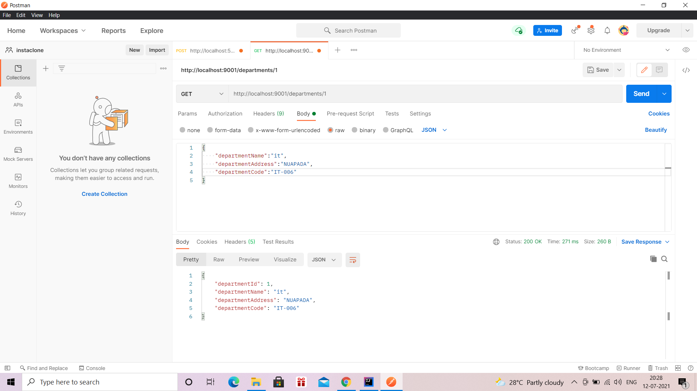
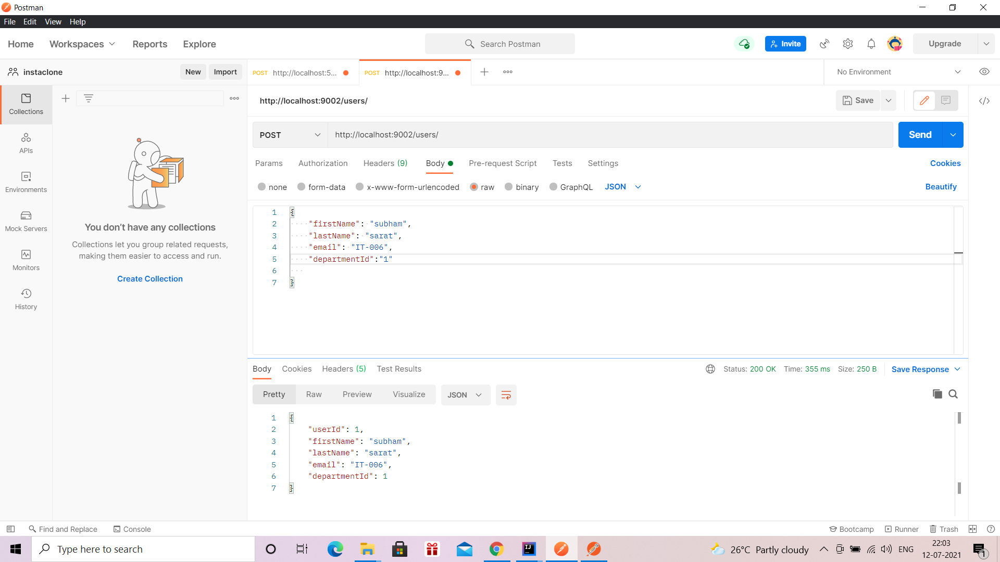
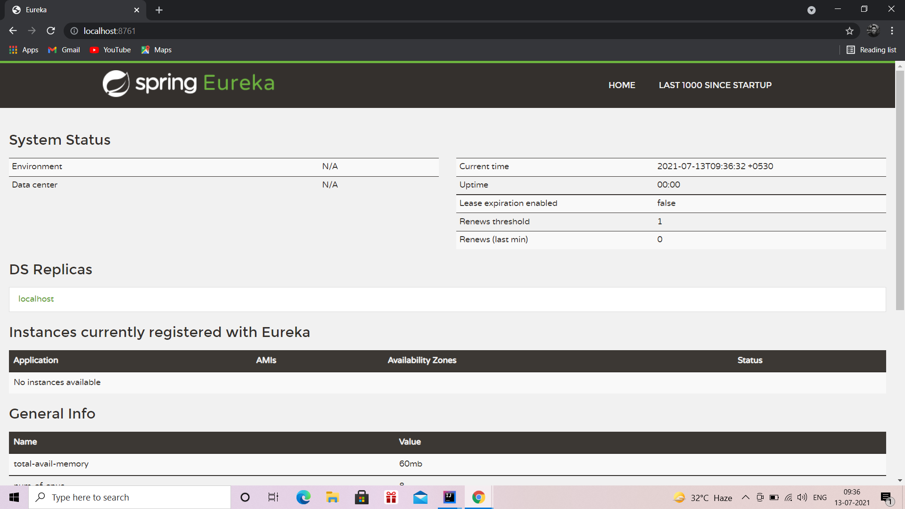
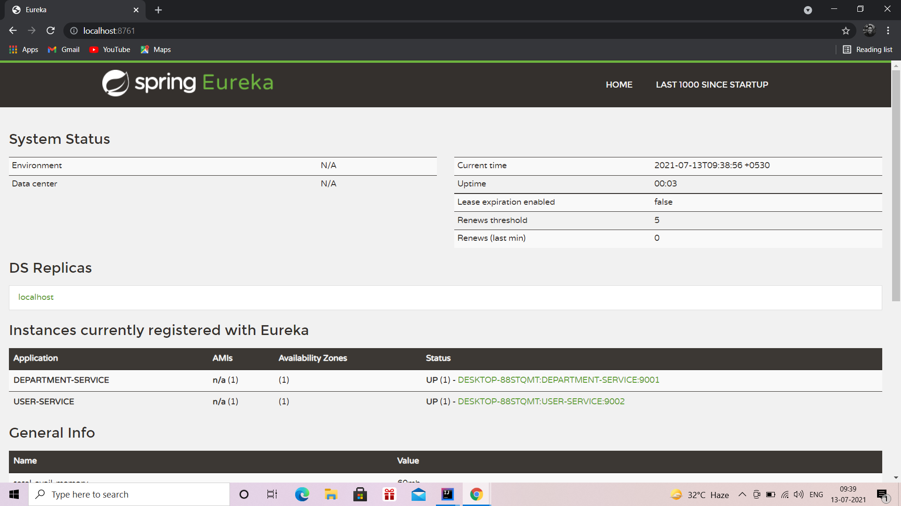
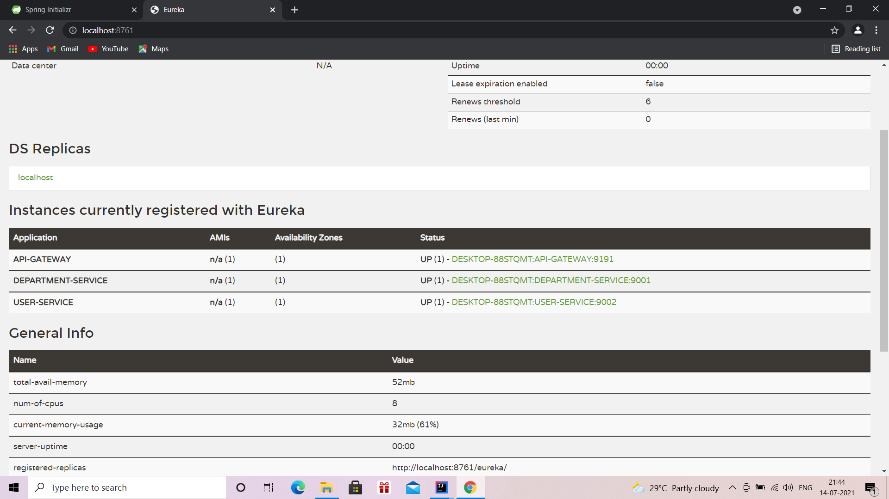
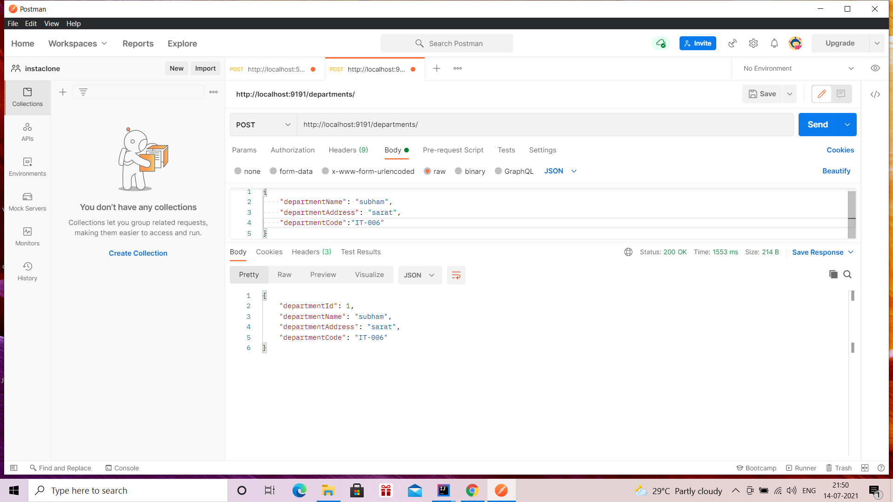
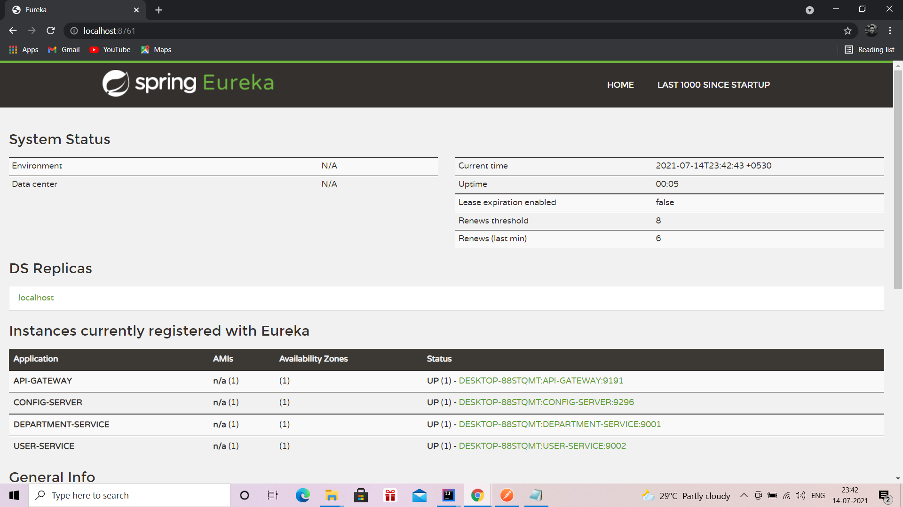

# microserviceuserdept

This project focuses on the implementation of basic microservice architecture using Spring framework.The configurations used are that of spring cloud.Two microservice are kept in focus here 
user service and department service.I have tried to follow the microservice level architecture,where handling data and API calls are important and crucial as it might lead to error .
Ports used for the services are=>
    1)User service:9002
    2)Department service:9001
    3)Service Registry:8761(Eureka service client for localhost
    4)API gateway:9191
    5)Cloud Config:9296
    
  
  Brief description:
  User service: interacts with department service by taking in details from the user and also annots the department id for the user departments.
  
  Department service:interacts with user service and also annots the department id for the users.
  
  Service Registry:denotes the common port for visualising which services are connected to the server and which are down.Also used for microservices to interact through their name and 
  not through port as port might change in between to creat error.
  
  API gateway:It handles the common path for the request through API to both the microservices and also its connected to the service registry.It also has the option of fall back or
  fault tolerance where in if some of the interacting microservices would stop the entire job execution is not halted rather an error msg for the respective microservice is shown.
  
  Cloud Config:It handles the common base for executing the microservices and service registry ie it contains the info regarding the Eureka cloud config for local. It is connected to 
  the github repo which fetches the data for all the above mentioned services including the ports and the local server of interaction.
  
  
  Images for the executions for the API's and the interaction of the microservices:
  
  
  
  
  
  
  
  

The final step of the project is to be done by deploying the microaervice into the docker platform and do the analysis.As I have still to learn the docker and kubernetes cloud cluster I have kept it for a later phase.

